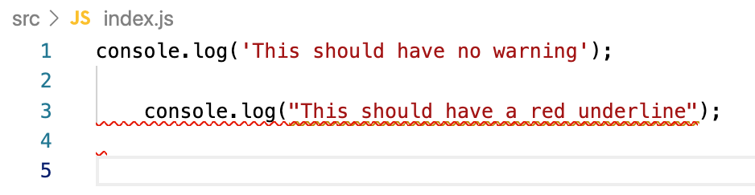

# Node Example

This is simply an example Node project for students to get familiar with running JavaScript in the terminal and using eslint, and prettier.

Before starting run `yarn install` to install dependencies.

Open up `src/index.js` and if you have eslint configured you should see something like this:

If you do see the red squiggly lines, then eslint is working properly.

If you save and see the code reformatted, then prettier is working properly.